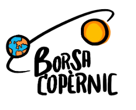
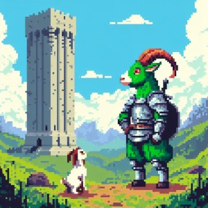

# Hola, mi nombre es Javier Morante 👋
###  Estudiante de Desarrollo de Aplicaciones Multiplataforma

I'm a Junior Sofwate Developer in Barselona, i am currenly studying a Higher Level Education Cycle of multiplatform aplication development (DAM)

- 📫 Contáctame en **javichu.monu@gmail.com**

## Tecnologias
| Tipo            | Tecnologia |
| :---------------- | ------: | 
| Lenguajes de programcion |    | 
| Frontend |   |
| BBDD  |   |
| Other Technologies | |
|IDE |   |

## School Projects

  